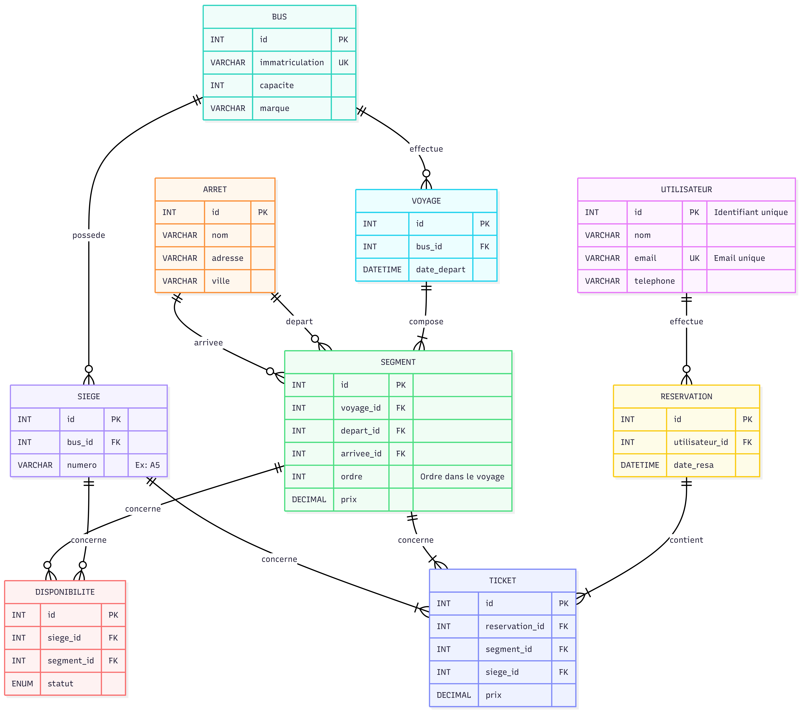

# Documentation d'Analyse - bookbus-laravel

## A. Analyse du domaine (étude de marKoub.ma)

### Processus de réservation (étapes utilisateur)

1. **Recherche de trajet**
   - L'utilisateur sélectionne la ville de départ et d'arrivée
   - Choix de la date de voyage
   - Sélection du nombre de passagers

2. **Sélection du voyage**
   - Affichage des voyages disponibles avec horaires et prix
   - Choix du voyage souhaité
   - Visualisation des places disponibles

3. **Sélection des places et points d'arrêt**
   - Choix des places dans le bus
   - Sélection des points d'arrêt pour monter/descendre (plusieurs points possibles)
   - Ajout de passagers supplémentaires si nécessaire

4. **Informations passagers**
   - Saisie des informations personnelles (nom, prénom, téléphone, email)
   - Validation des informations

5. **Paiement**
   - Choix du mode de paiement
   - Saisie des informations de paiement
   - Confirmation de la réservation

6. **Confirmation et billets**
   - Récapitulatif de la réservation
   - Envoi des billets par email
   - Possibilité de télécharger les billets

### Entités principales identifiées

1. **Utilisateur**
   - ID, nom, prénom, email, téléphone, mot de passe, rôle
   - Relations: crée des réservations, possède des passagers

2. **Voyage**
   - ID, ville départ, ville arrivée, date, heure départ, heure arrivée, prix, compagnie
   - Relations: a des réservations, a des points d'arrêt

3. **Réservation**
   - ID, utilisateur_id, voyage_id, date_réservation, statut, total_prix
   - Relations: appartient à un utilisateur, concerne un voyage, contient des passagers

4. **Passager**
   - ID, réservation_id, nom, prénom, téléphone, place_assignée
   - Relations: appartient à une réservation

5. **PointArrêt**
   - ID, voyage_id, ville, adresse, heure_arrêt, type (montée/descente)
   - Relations: appartient à un voyage, associé à des passagers

6. **Compagnie**
   - ID, nom, description, logo, contact
   - Relations: propose des voyages

### Flux d'administration observé

1. **Gestion des compagnies**
   - Ajout/modification/suppression de compagnies
   - Gestion des informations de contact

2. **Gestion des voyages**
   - Création de nouveaux trajets
   - Mise à jour des horaires et prix
   - Gestion de la disponibilité

3. **Gestion des réservations**
   - Visualisation de toutes les réservations
   - Modification du statut des réservations
   - Remboursement/annulation

4. **Gestion des utilisateurs**
   - Visualisation des utilisateurs inscrits
   - Gestion des rôles et permissions
   - Blocage/déblocage de comptes

5. **Rapports et statistiques**
   - Rapports de ventes par période
   - Statistiques de remplissage des bus
   - Analyse des destinations populaires

## B. Proposition d'architecture

### Schéma de base de données (MCD/ERD)

### Liste des fonctionnalités MVP

**Fonctionnalités utilisateur:**
1. Inscription et connexion
2. Recherche de voyages par trajet et date
3. Visualisation des détails des voyages
4. Sélection des places et points d'arrêt
5. Création de réservation avec paiement
6. Gestion de son profil utilisateur
7. Visualisation de l'historique des réservations
8. Téléchargement des billets

**Fonctionnalités administration:**
1. Gestion des compagnies de bus
2. Création et gestion des voyages
3. Gestion des réservations (validation, annulation)
4. Gestion des utilisateurs
5. Tableau de bord statistiques
6. Gestion des points d'arrêt

### Diagramme de cas d'utilisation

### Diagramme de classes

## C. Choix techniques
### Justification du choix de Laravel pour ce projet
**Avantages de Laravel:**
1. Rapidité de développement: structure MVC bien définie avec un système de routing puissant en plus d'un ORM Eloquent pour la gestion de la base de données
2. Sécurité renforcée: protection CSRF intégrée, hashage de mots de passe sécurisé et protection SQL injection via Eloquent
3. Communauté active: documentation complète et bien maintenue, nombreux packages disponibles et un support communautaire important
4.  Adaptabilité au projet: parfait pour les applications web complexes, gestion facile des relations entre entités et un support multi-base de données